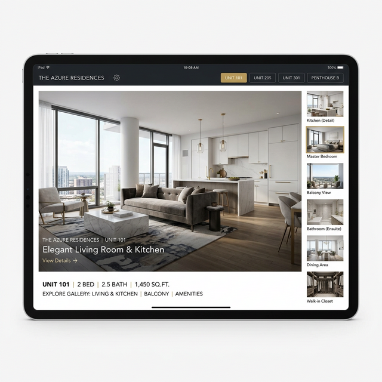
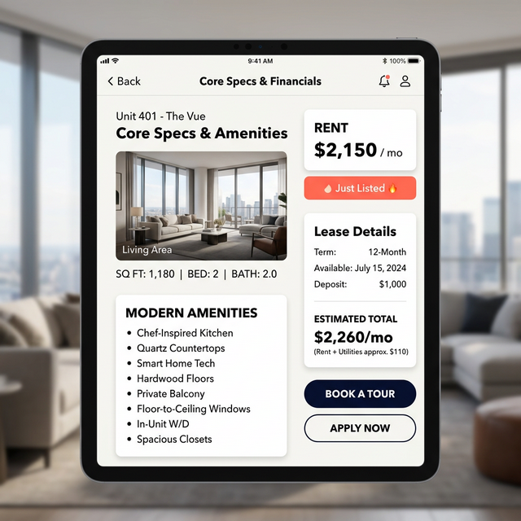
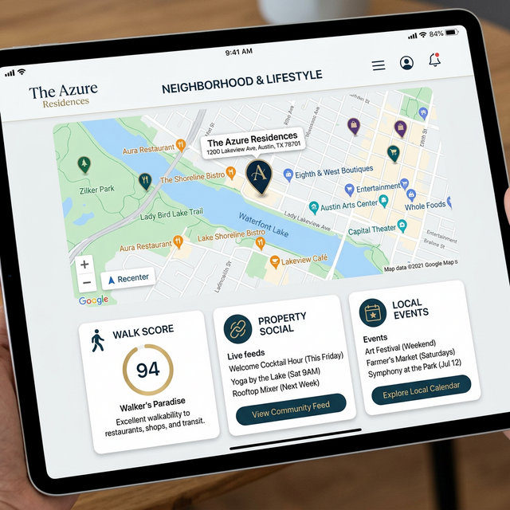

# Tour iPad Assistant: Concept & Brainstorming
**Leasing Staff Consultation Document**

## 1. Introduction
We are designing a premium, touch-first iPad application to serve as a **Tour Companion**. This app is meant to be held by the leasing staff and presented side-by-side with prospective residents during property tours.

**Core Philosophy:**
*   **Prospect-Safe:** Clean, simple data. Zero internal operational jargon or sensitive backend information.
*   **Highly Visual:** Large text, beautiful images, and easy to read from 2-3 feet away.
*   **The "Digital Binder":** Replaces paper floorplans and scattered browser tabs with a single, fluid presentation tool.

---

## 2. Our 3-Device Strategy (The Department Ecosystem)
Before diving into the iPad specifics, it helps to understand how the Tour Companion fits into our larger operational ecosystem. We are building a unified platform accessed via three distinct device models, each tailored to a specific department workflow:

### A. The PC (The Operations Hub)
*   **The User:** Property Managers, Back-Office Staff, and Leasing Agents (when at their desk).
*   **The Workflow:** Heavy data entry, complex reporting, comprehensive Excel-like spreadsheet views, lease generation, and backend system configuration.
*   **The Concept:** This is the command center where the dense, operational "heavy lifting" happens. It is meant for single-user productivity.

### B. The Tablet / iPad (The Presentation Tool)
*   **The User:** Leasing Agents (during tours) and Prospects.
*   **The Workflow:** Walking the property, showcasing units, and closing deals.
*   **The Concept:** This is the *shared experience* device. It deliberately strips away the complex ops data from the PC view in favor of large, beautiful, prospect-safe visuals and simple talking points. 

### C. The Phone (The On-The-Go Assistant)
*   **The User:** Maintenance Staff and Leasing Agents (when moving around the property without a prospect).
*   **The Workflow:** Quick messaging, snapping and uploading photos of units/maintenance issues, and doing rapid status checks.
*   **The Concept:** The fastest tactical tool. It's built for speed and burst-actions rather than deep presentation or heavy data entry.

---

## 2. The Welcome Screen & Shortlist
Before the tour begins, the agent and prospect can review the available units and build a shortlist using the standard app interface (with the left navigation sidebar).

*The Availabilities Prep List Screen*

**Interaction Model:**
*   **Top Shortlist Bar:** A row of buttons at the top of the iPad showing up to 4 selected units for the tour. Tapping these is the *only* way to switch from one unit's dossier to another.
*   **Horizontal Swiping:** Swiping left and right on the main screen turns the "pages" *within* the currently selected unit's dossier. 

---

## 3. The "Presentation Mode" Toggle (Full Screen vs. Windowed)
You might notice the mockups show a completely immersive, full-screen experience. 

Because the app is initially used for setup (finding units via the left sidebar) but *then* used as a presentation tool during the physical tour, we propose adding a **"Presentation Mode" Toggle**.

*   **Setup State (Windowed):** The left sidebar and top property selector are visible. The agent uses this to navigate the app and build the tour list safely before the prospect arrives.

*The underlying Dashboard with Sidebar (Setup State)*
*   **The Toggle:** An "Enter Tour Mode" or "Maximize" icon (like a standard full-screen icon `[ ]`) located on the top Shortlist Bar. 
*   **Presentation State (Full Screen):** When the physical tour begins, tapping the toggle collapses the left sidebar to `0px` and hides the top property selector. The screen becomes 100% dedicated to the Unit Dossier, creating an immersive, distraction-free presentation experience for the prospect. A simple "Close / Minimize" icon allows the agent to return to the standard app view.

---

## 4. The 4 Swipeable Pages of the Unit Dossier
When a unit is selected and Presentation Mode is active, the leasing agent can swipe horizontally through these 4 pages to tell the story of the apartment.

### Page 1: The Visual Gallery (The "Hook")
*   **Purpose:** Sell the dream through high-quality visual media.
*   **Interaction:** The agent scrolls vertically (up and down) to view more photos of the unit, leaving the horizontal swipe strictly for changing pages.

*Concept Idea for the Visual Gallery*

### Page 2: Core Specs & Financials (The "Business")
*   **Purpose:** Give the prospect the hard facts they need to make a decision.
*   **Content:** Highlights such as Rent, SqFt, Bed/Bath, Available Date, unit-specific features, and estimated Move-In Costs.

*Concept Idea for Core Specs*

### Page 3: The Spatial Layout (The "Blueprint")
*   **Purpose:** Help the prospect visualize their life and furniture in the space.
*   **Content:** A crisp, high-resolution floorplan image. Includes interactive "Pinch-to-Zoom" capabilities.

### Page 4: The Neighborhood & Lifestyle (The "Toolkit")
*   **Purpose:** Consolidate external tools into the app so the agent never has to awkwardly switch to Safari or Google Chrome.
*   **Content:** Local Map, Walk Score, and Community Highlights (e.g., recent property Instagram posts).

*Concept Idea for Neighborhood Integration*

---

## 5. Questions for the Leasing Team (Brainstorming)
To finalize this design, we need your operational expertise:

1.  **Core Specs:** What are the absolute "must-have" stats you need available at a glance?
2.  **Visuals:** Are there specific angles or types of photos that typically seal the deal?
3.  **Presentation Toggle:** Would a "Full Screen / Tour Mode" toggle be useful, or do you prefer having the left sidebar permanently visible during the physical tour?
4.  **External Tools:** Do you frequently use Walk Score or Google Maps on your phone right now during tours? 
5.  **Shortlist Size:** How many units do you typically show on a single tour? 
6.  **Missing Info:** Is there any other data or talking point you currently rely on during a tour that we haven't included in these 4 pages?
